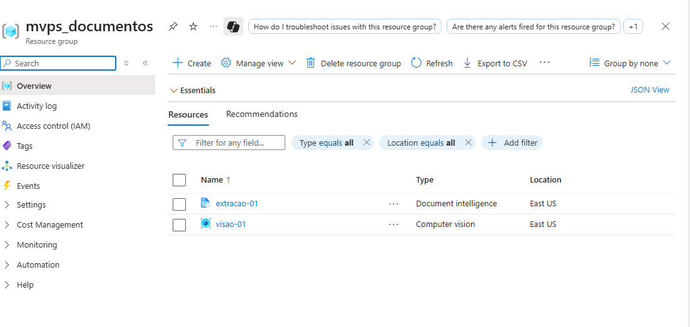
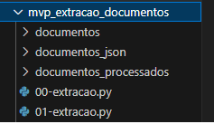
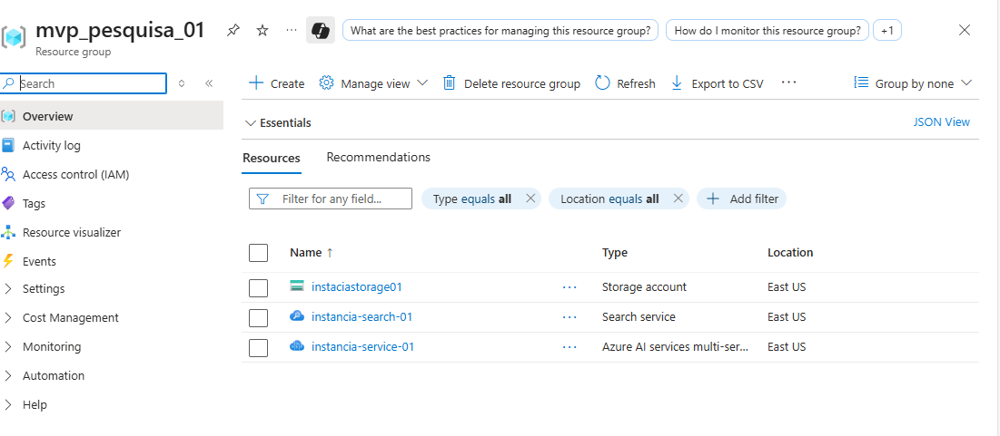
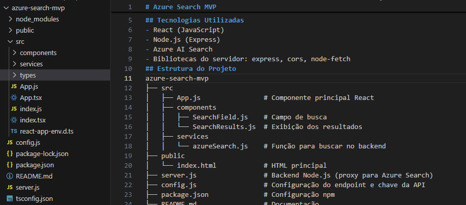
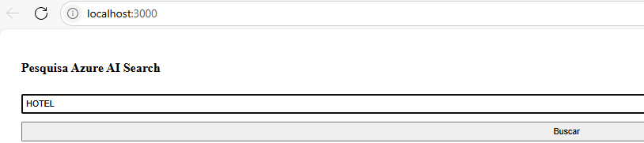
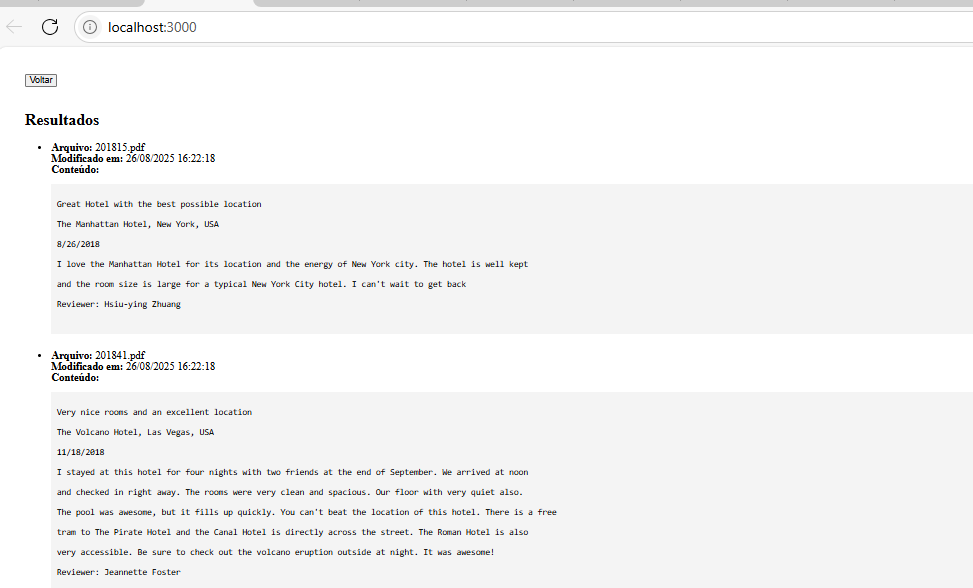
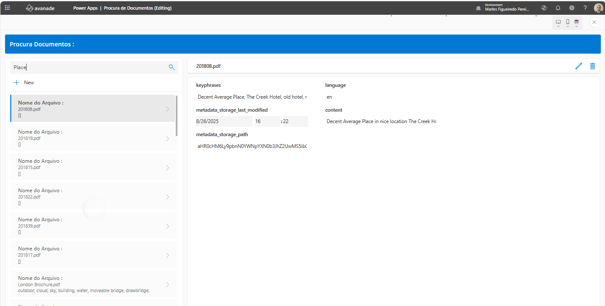
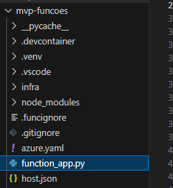
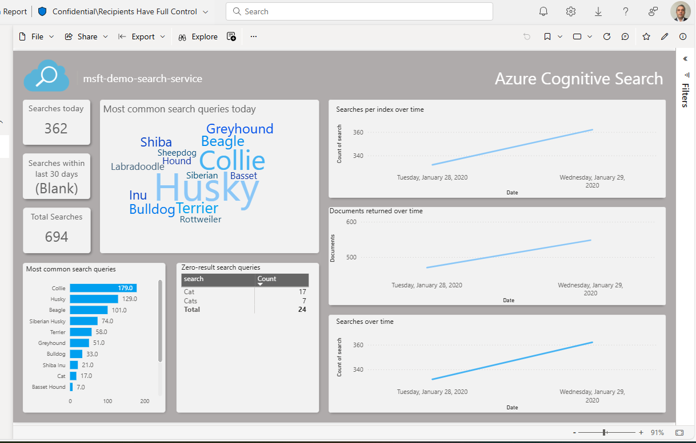
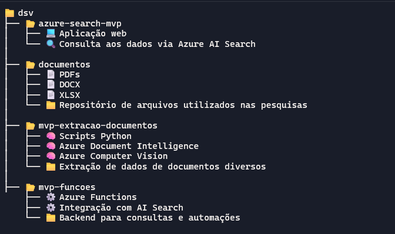

# Documentação do MVP Cognitive Search :

Introdução :
---
A solução Operational Cognitive Search, impulsionada por inteligência artificial, oferece   uma nova forma de realizar buscas contextuais, ágeis e precisas em sua base de documentos técnicos (PDFs, Excel, DOCX, RTAs). Essa tecnologia elimina os gargalos tradicionais na recuperação de informações, revolucionando o acesso e a aplicação do conhecimento no cotidiano operacional.
 
Esse novo modelo reduz a dependência de conhecimento tácito, fortalece a rastreabilidade das informações e aumenta a confiabilidade nas decisões, além de gerar ganhos significativos em agilidade, padronização e continuidade operacional.

Objetivo :
---

Este documento tem como propósito apresentar o desenvolvimento e os componentes utilizados na construção do primeiro MVP (Produto Mínimo Viável) para a implementação da solução Operational Cognitive Search. A seguir, são detalhados os principais itens abordados:

1. Utilização do Azure AI Document Intelligence
Explanação sobre como essa tecnologia foi aplicada para extrair e interpretar informações de documentos técnicos.
2. Utilização do Azure AI Search e Recursos Criados
Descrição dos recursos configurados no Azure AI Search, incluindo indexação, fontes de dados e modelos de busca inteligente.
3. Aplicação Web com React e Node.js
Apresentação da aplicação desenvolvida em React (JavaScript) com backend em Node.js (Express), responsável pela integração com o Azure AI Search.
4. Integração com Power Apps
Detalhamento da aplicação criada no Power Apps para facilitar o acesso à busca cognitiva diretamente pelas células operacionais.
5. Uso do Power BI para Avaliação das Pesquisas
Demonstração de como o Power BI foi utilizado para monitorar e avaliar o desempenho das buscas realizadas pelos usuários.
6. Referência das Árvores de Fontes Criadas
Organização e estrutura das fontes de dados utilizadas, incluindo a hierarquia e categorização dos documentos.
7. Conclusão e Próximos Passos
Resumo dos resultados obtidos com o MVP e sugestões para evoluções futuras da solução.

 
**1. Utilização do Azure AI Document Intelligence**
---

Nesta etapa do MVP, foram exploradas as capacidades do Azure AI Document Intelligence para extrair, interpretar e organizar informações contidas em documentos técnicos, como PDFs, planilhas e arquivos de texto. A solução permite identificar campos, tabelas, imagens e estruturas semânticas, facilitando a indexação e a busca contextual.

🛠️ Recursos Criados na Azure:

- Document Intelligence
Utilizado para análise avançada de documentos, com reconhecimento de layout, extração de texto estruturado e identificação de entidades relevantes.

- Computer Vision
Aplicado para complementar a leitura de documentos com imagens, realizando OCR (Reconhecimento Óptico de Caracteres) e interpretação visual de elementos gráficos.

  

Esses recursos são  integrados ao [pipeline de ingestão de dados](mvp_documentacao_pipelines.md)
, permitindo que documentos técnicos sejam processados automaticamente e fiquem disponíveis para busca inteligente via Operational Cognitive Search.

 

Programas implementados :

  

 
1. Extração com Azure Computer Vision

Foi desenvolvido um script em Python que utiliza o serviço Computer Vision para realizar OCR (Reconhecimento Óptico de Caracteres) em documentos mais simples, como imagens escaneadas ou PDFs sem estrutura definida. Esse programa é ideal para capturar texto bruto de documentos que não possuem formatação complexa.

2. Extração com Azure Document Intelligence

Outro script em Python foi implementado utilizando o Azure AI Document Intelligence, voltado para documentos estruturados, como formulários, relatórios técnicos e planilhas. Esse recurso permite identificar campos, tabelas, seções e hierarquias de conteúdo, facilitando a organização e indexação das informações extraídas.
Esses dois programas atuam como fontes de dados para alimentar o mecanismo de busca cognitiva, garantindo que tanto documentos simples quanto estruturados sejam processados e disponibilizados para consulta inteligente.

    

**2. Utilização do Azure AI Search e Recursos Criados**
---
 

Nesta etapa do MVP, foi implementada a solução Azure AI Search para viabilizar buscas inteligentes e contextuais sobre documentos técnicos. A seguir, são detalhados os principais recursos e procedimentos adotados:

  

- Storage Account
Utilizado para armazenar os documentos técnicos (PDFs, DOCX, Excel, etc.) que alimentam o mecanismo de busca.
- Search Service
Serviço central do Azure AI Search, responsável por indexar os documentos e permitir consultas rápidas e relevantes.
- Azure AI Services (Multi-service)
Conjunto de serviços cognitivos integrados para enriquecer os dados com análise semântica, OCR, extração de entidades e compreensão de linguagem natural.

**3.Aplicação Web com React e Node.js**
---

  

A aplicação foi dividida em dois componentes principais:

Backend em Python:

Responsável por intermediar a comunicação com o serviço Azure AI Search. As principais funções implementadas incluem:
- Receber o texto de busca enviado pela aplicação web.
- Enviar a consulta ao Azure AI Search, utilizando a API REST ou o SDK oficial.
- Processar os resultados, extraindo:
- Trechos relevantes do conteúdo (highlights).
- Nome do documento (campo metadata_storage_name ou similar).
- Retornar os dados em formato JSON para o frontend.

🎨 Frontend :

A interface web foi desenvolvida para permitir que o usuário insira um texto de busca e visualize os resultados de forma clara e interativa.
Principais funcionalidades:
- Campo de busca para entrada do texto.
- Chamada à API Python via fetch ou axios.
- Renderização dos resultados, exibindo:
- Nome do documento.

🔁 Integração e Fluxo

  

  

- Usuário digita o texto de busca na interface React.
- React envia a consulta para o backend Python.
- Python consulta o Azure AI Search e retorna os resultados.
- React exibe os trechos encontrados e os nomes dos documentos.

### Etapas para Configurar a Pesquisa Semântica no Azure AI Search:

1. Pré-requisitos
- Um serviço de Azure AI Search na camada Básica ou superior.
- Um índice de pesquisa existente com campos de texto ricos (ex: corpo de documentos, descrições).
- A funcionalidade de classificação semântica habilitada na sua região e serviço.

2. Criar ou Atualizar o Índice com Configuração Semântica
Você pode configurar a pesquisa semântica diretamente no Portal do Azure, via API REST, ou usando SDKs (.NET, Python, JavaScript).
A configuração semântica inclui:
- Campo de título: texto curto que representa o documento (ex: nome, título).
- Campos de conteúdo: trechos mais longos em linguagem natural (ex: corpo do documento, descrição).
- Nome da configuração semântica: identificador que será usado nas consultas.
  

 

**4. Integração com Power Apps**
--- 

È possivel integrar diretamente o Power Apps com o Azure AI Search por meio de um conector personalizado, mas é importante observar que essa 
integração exige que o plano do serviço de busca esteja em uma camada compatível com APIs externas e recursos cognitivos.

💡 Plano Recomendado para Azure AI Search : Plano Standard S1 ou superior

🔐 Além disso, é necessário configurar autenticação segura (como Azure AD ou chave de API) para que o Power Apps possa se comunicar com o serviço de busca por meio de um conector personalizado ou via Power Automate.

  
Azure Functions: 

Em vez de criar um conector direto para o Azure AI Search, essa abordagem utiliza Azure Functions como uma camada intermediária entre o Power Apps e o serviço de busca. Isso oferece mais controle, segurança e flexibilidade na manipulação dos dados.
🧩 Estrutura da Solução
- Power Apps
Interface onde o usuário insere o texto de busca e visualiza os resultados.
- Azure Function
Função serverless que recebe a consulta, acessa o Azure AI Search, processa os resultados e retorna ao Power Apps.
- Azure AI Search
Serviço que realiza a busca semântica ou textual nos documentos indexados.
 

 

**5. Uso do Power BI para Avaliação das Pesquisas**
--- 

Usamos oPower BI para avaliar o desempenho das pesquisas realizadas no Azure AI Search, oferecendo insights sobre comportamento dos usuários, relevância dos resultados e eficiência da indexação.

Principais Métricas Avalidas:

- 🔍 Volume de buscas por período
- 📄 Documentos mais acessados
- 🧠 Consultas semânticas vs. consultas simples
- ⏱️ Tempo médio de resposta
- ❌ Consultas sem retorno (zero results)
- 📈 Tendências de uso por célula operacional ou tipo de documento

	.

**6. Referência das Árvores de Fontes Criadas**
--- 

  

 

**7.Conclusão próximos passos**
--- 

A criação deste MVP demonstrou de forma clara a viabilidade da implantação da solução proposta. No entanto, para sua consolidação em ambiente produtivo, ainda são necessárias algumas etapas complementares:

- 🔄 Integração com os processos operacionais do cliente
Alinhar a solução às rotinas e fluxos já existentes, garantindo aderência e valor agregado ao dia a dia das equipes.
- 🏗️ Implantação em ambiente mais robusto
Migrar o MVP para uma infraestrutura escalável e segura, adequada ao volume de dados e à criticidade das operações.
- 🔐 Definição e aprimoramento do processo de autenticação
Estabelecer mecanismos de controle de acesso mais eficientes, garantindo segurança, rastreabilidade e conformidade com as políticas da organização.

 